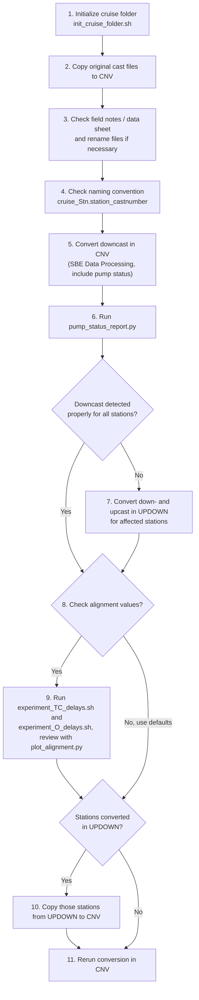

# CTD Profile Explorer

This Dash app finds `.cnv` files in `OUT/*/06-drv`, presents the filenames
shared by all folders once, and creates one interactive pressure profile per
folder directly under `OUT`.

## CTD conversion workflow

1. Initialize the cruise folder for conversion with `init_cruise_folder.sh`.
2. Copy the original CTD cast files to the `CNV` directory.
3. Read the cruise field notes or data sheet, and rename the files in the
   `CNV` folder if necessary.
4. Make sure the filenames follow the naming convention
   `<cruise_name>_Stn.<station_name>_<running_cast_order_number>`.
5. Convert all data in the `CNV` directory with the Sea-Bird SBE Data
   Processing software, processing only the downcast. Include the pump status
   variable if it is available.
6. Run `pump_status_report.py` (see [Command-line pump report](#command-line-pump-report))
   to check whether the Sea-Bird software kept too little data for any file
   when it detected the downcast.
7. For stations where the downcast was not detected properly, run the
   conversion in the `UPDOWN` folder, including both the downcast and the
   upcast.
8. Decide whether to check the conductivity and oxygen alignment values
   (step 9) or use the default alignment values (step 10).
9. Run `experiment_TC_delays.sh` and `experiment_O_delays.sh` to test the
   temperature-conductivity and oxygen alignment values. Review the results
   with `plot_alignment.py`.
10. If the downcast was not detected properly for any stations, copy the data
    for those stations from the `UPDOWN` folder to the `CNV` folder.
11. Run the conversion once more in the `CNV` folder, using the modified
    alignment values or the new data files from `UPDOWN`.



## Run

```powershell
python -m pip install -r requirements.txt
python plot_alignment.py "D:\path\to\alignment-root"
```

The path can be an alignment folder that directly contains
`OUT/*/06-drv`, or a parent whose immediate subfolders contain that structure.
If several matching subfolders are found, the app lists them in the terminal
and prompts you to select one by number. If the path is omitted, the app uses
the directory containing `plot_alignment.py`.

Open the local address printed in the terminal, normally
<http://127.0.0.1:8050>.

Select one CNV filename, the number of initial scans to discard, and up to
five variables. The same selections are applied to every folder plot. Pressure
is plotted downward, and each selected variable has its own x-axis scale.
The **Custom X/Y axes** tab lets you select one X variable and one Y variable
for a single-axis plot of each alignment folder. Its Y axis is inverted.

## Pump status report

Run the separate pump-status app with:

```powershell
python app_pump_status.py "D:\path\to\search-root"
```

The folder argument is optional and defaults to the directory containing the
app. The app discovers CNV files only beneath this search root. Custom paths
must also be inside it; relative custom paths are resolved from the search
root.

Open <http://127.0.0.1:8051>. Select a discovered CNV folder or enter a custom
path, then select **Analyze folder**. The report separates files whose pump
status contains only zeroes from files containing a value of one. For pump-on
files, the results table shows the first zero-to-one transition index, pressure
at that transition with the file's maximum pressure in parentheses, last
pump-on index, number of pump-on rows, sampling interval, pump-on duration in
seconds, and total row count.

To export short pump-on results, enter a maximum pump-on time in seconds and
select **Write CSV report** after analyzing the folder. The downloaded CSV
contains zero-only files and files whose calculated pump-on duration is at or
below the threshold. Files without a sampling interval cannot be compared and
are excluded.

## Command-line pump report

To produce the same report in a terminal for a directory and all its
subfolders:

```powershell
python pump_status_report.py "D:\path\to\cnv-directory"
```

By default, the script writes `pump_status_report.txt` inside the analyzed
directory. Specify another output file with:

```powershell
python pump_status_report.py "D:\path\to\cnv-directory" `
  --output "D:\reports\pump-report.txt"
```

Pump-on files are ordered from shortest to longest duration.

## CNV file summary

To recursively list each CNV file's variables and number of data rows:

```powershell
python cnv_file_summary.py "D:\path\to\cnv-directory"
```

The tab-separated results include each file's variables, data-row count, and
maximum pressure (`prDM`), printed from shortest to longest data length.

## Compare CNV data lengths

To compare matching filenames in `CNV/01-cnv` and `UPDOWN/01-cnv`:

```powershell
python compare_cnv_lengths.py "D:\path\to\cruise-folder"
```

The tab-separated output shows both row counts side by side, their signed row
difference, and the `CNV/01-cnv` length as a percentage of the corresponding
`UPDOWN/01-cnv` length. Results with the smallest relative CNV length are shown
first. Filename matching is case-insensitive.

## CNV file viewer

Run the searchable CNV visualization app with:

```powershell
python plot_cnv_files.py "D:\path\to\cnv-directory"
```

Open <http://127.0.0.1:8053>. Files beneath the supplied folder are ordered by
data length, shortest first, in the left sidebar. Select a filename, search the
list, or use **Next file** to cycle through files. Each included variable is
plotted against the zero-based data index in its own vertically stacked plot.
Pressure is shown first with an inverted y-axis; all other y-axes use their
normal direction. `timeS`, `latitude`, `longitude`, and `flag` are omitted.
To switch datasets without restarting the app, choose another folder from the
searchable **First-column folder** list and select **Load folder**. The folder
lists include the directory that contains `plot_cnv_files.py` and the
subfolders beneath it. The command-line folder is the one opened at startup.

To compare matching files side by side, choose a **Second-column folder** and
select **Add / update**. The app finds a file with the same case-insensitive
filename and displays it in a second plot column. Select **Remove** to return
to one column.

## Single-folder profile explorer

`plot_single_folder.py` is a separate version of the profile explorer that
loads CNV files directly from one selected leaf folder. It does not search
below the selected folder.

```powershell
python plot_single_folder.py
```

Open <http://127.0.0.1:8052>. The app does not search for CNV files when it
starts and does not select a folder automatically. Select any folder from the
subfolder tree, including folders nested at arbitrary depth, or enter a custom
folder path. Select **Load folder** to find the CNV files directly inside that
folder.

The custom path field accepts native Windows paths such as
`D:\data\cruise\CNV\02-flt`, including paths copied from Explorer with quotes.
When the app runs under WSL/Linux, a Windows drive path is translated to its
WSL mount automatically (for example, `D:\data` becomes `/mnt/d/data`).
Environment variables and paths relative to the app directory are also
accepted.

The inverted y-axis can be switched between pressure and the original
zero-based data-row index. The original `plot_alignment.py` is unchanged.
