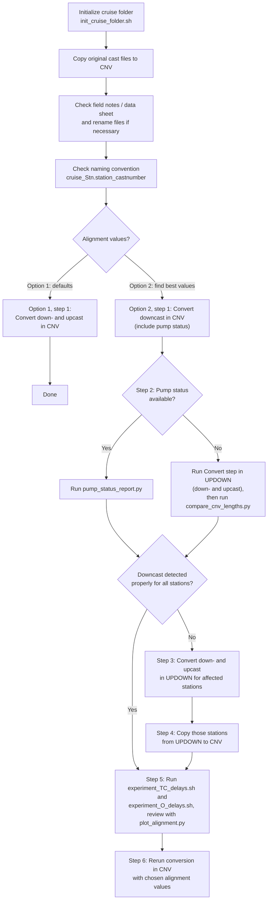

# Seabird CTD Data Processing Toolkit

This project contains scripts and interactive apps for converting and checking
Sea-Bird CTD cast data from SFER cruises. It supports the full workflow, from
preparing a cruise folder and checking file names to processing casts with the
Sea-Bird SBE Data Processing software. The tools help find casts where
downcast detection kept too little data, using pump status or by comparing
downcast-only and down-and-upcast conversions. They also let you test and
compare conductivity and oxygen alignment values, and browse the converted CNV
files as interactive plots.

## Installation

The scripts and apps need Python 3 with the packages listed in
`requirements.txt`. Install them in a virtual environment so they stay
separate from other Python projects. Run these commands in this folder. The
environment name `.venv` is only an example.

In Windows PowerShell:

```powershell
python -m venv .venv
.\.venv\Scripts\Activate.ps1
python -m pip install -r requirements.txt
```

If PowerShell refuses to run `Activate.ps1`, allow local scripts for your user
once with `Set-ExecutionPolicy -Scope CurrentUser RemoteSigned`, then activate
again.

In bash on WSL or Linux:

```bash
python3 -m venv .venv
source .venv/bin/activate
python -m pip install -r requirements.txt
```

In Git Bash on Windows, the activation script is in a different folder:

```bash
python -m venv .venv
source .venv/Scripts/activate
python -m pip install -r requirements.txt
```

Activate the environment again in each new terminal before running the scripts.
Run `deactivate` to leave it.

## Recommended CTD conversion workflow

### Prepare the cruise folder

Do these steps for both options below.

1. Initialize the cruise folder for conversion with `init_cruise_folder.sh`.
2. Copy the original CTD cast files to the `CNV` directory.
3. Read the cruise field notes or data sheet, and rename the files in the
  `CNV` folder if necessary.
4. Make sure the filenames follow the naming convention
  `<cruise_name>_Stn.<station_name>[_running_cast_number]`. Running cast number is optional in this SW, except when necessary to separate two or more casts at the same station.

Then choose one of the two options.

### Option 1: Use the default alignment values

Use this option if the default conductivity and oxygen alignment values are
good enough.

1. Convert all data in the `CNV` directory with the Sea-Bird SBE Data
  Processing software, including both the downcast and the upcast.

No other steps are needed.

### Option 2: Find the best alignment values

Use this option to test and choose the conductivity and oxygen alignment
values.

1. Convert all data in the `CNV` directory with the Sea-Bird SBE Data
  Processing software, processing only the downcast. Include the pump status
   variable if it is available.
2. Check whether the Sea-Bird software kept too little data for any file when
  it detected the downcast:
  - **If the pump status variable is available,** run
  `pump_status_report.py` (see
  [Command-line pump report](#command-line-pump-report)).
  - **If pump status is not available,** run at least the first (Convert)
  step of the Sea-Bird Data Conversion software in the `UPDOWN` folder,
  including both the downcast and the upcast. Then run
  `compare_cnv_lengths.py` (see
  [Compare CNV data lengths](#compare-cnv-data-lengths)) to find downcast
  files in the `CNV` folder that are probably too short.
3. For stations where the downcast was not detected properly, run the
  conversion in the `UPDOWN` folder, including both the downcast and the
   upcast. If you already ran only the Convert step there in step 2, run the
   remaining processing steps for those stations.
4. If the downcast was not detected properly for any stations, copy the data
  for those stations from the `UPDOWN` folder to the `CNV` folder.
5. Run `experiment_TC_delays.sh` (see
   [Conductivity alignment experiment](#conductivity-alignment-experiment))
   and `experiment_O_delays.sh` (see
   [Oxygen alignment experiment](#oxygen-alignment-experiment)) to test the
   temperature-conductivity and oxygen alignment values. Review the results
   with `plot_alignment.py`.
6. Run the conversion once more in the `CNV` folder, using the chosen
  alignment values and any new data files from `UPDOWN`.



## Pump status report

Run the separate pump-status app with:

```powershell
python app_pump_status.py "D:\path\to\search-root"
```

The folder argument is optional and defaults to the directory containing the
app. The app discovers CNV files only beneath this search root. Custom paths
must also be inside it; relative custom paths are resolved from the search
root.

Open [http://127.0.0.1:8051](http://127.0.0.1:8051). Select a discovered CNV folder or enter a custom
path, then select **Analyze folder**. The report separates files whose pump
status contains only zeroes from files containing a value of one. For pump-on
files, the results table shows the first zero-to-one transition index, pressure
at that transition with the file's maximum pressure in parentheses, last
pump-on index, number of pump-on rows, sampling interval, pump-on duration in
seconds, and total row count.

To export short pump-on results, enter a maximum pump-on time in seconds and
select **Write CSV report** after analyzing the folder. The downloaded CSV
contains zero-only files and files whose calculated pump-on duration is at or
below the threshold. Files without a sampling interval cannot be compared and
are excluded.

## Command-line pump report

To produce the same report in a terminal for a directory and all its
subfolders:

```powershell
python pump_status_report.py "D:\path\to\cnv-directory"
```

By default, the script writes `pump_status_report.txt` inside the analyzed
directory. Specify another output file with:

```powershell
python pump_status_report.py "D:\path\to\cnv-directory" `
  --output "D:\reports\pump-report.txt"
```

Pump-on files are ordered from shortest to longest duration.

## CNV file summary

To recursively list each CNV file's variables and number of data rows:

```powershell
python cnv_file_summary.py "D:\path\to\cnv-directory"
```

The tab-separated results include each file's variables, data-row count, and
maximum pressure (`prDM`), printed from shortest to longest data length.

## Compare CNV data lengths

To compare matching filenames in `CNV/01-cnv` and `UPDOWN/01-cnv`:

```powershell
python compare_cnv_lengths.py "D:\path\to\cruise-folder"
```

The tab-separated output shows both row counts side by side, their signed row
difference, and the `CNV/01-cnv` length as a percentage of the corresponding
`UPDOWN/01-cnv` length. The last column shows the maximum pressure (`prDM`) in
the `UPDOWN/01-cnv` file. Results with the smallest relative CNV length are
shown first. Filename matching is case-insensitive.

## CNV file viewer

Run the searchable CNV visualization app with:

```powershell
python plot_cnv_files.py "D:\path\to\cnv-directory"
```

Open [http://127.0.0.1:8053](http://127.0.0.1:8053). Files beneath the supplied folder are ordered by
data length, shortest first, in the left sidebar. Select a filename, search the
list, or use **Next file** to cycle through files. Each included variable is
plotted against the zero-based data index in its own vertically stacked plot.
Pressure is shown first with an inverted y-axis; all other y-axes use their
normal direction. `timeS`, `latitude`, `longitude`, and `flag` are omitted.
To switch datasets without restarting the app, choose another folder from the
searchable **First-column folder** list and select **Load folder**. The folder
lists include the directory that contains `plot_cnv_files.py` and the
subfolders beneath it. The command-line folder is the one opened at startup.

To compare matching files side by side, choose a **Second-column folder** and
select **Add / update**. The app finds a file with the same case-insensitive
filename and displays it in a second plot column. Select **Remove** to return
to one column.

## Single-folder profile explorer

`plot_single_folder.py` is a separate version of the profile explorer that
loads CNV files directly from one selected leaf folder. It does not search
below the selected folder.

```powershell
python plot_single_folder.py
```

Open [http://127.0.0.1:8052](http://127.0.0.1:8052). The app does not search for CNV files when it
starts and does not select a folder automatically. Select any folder from the
subfolder tree, including folders nested at arbitrary depth, or enter a custom
folder path. Select **Load folder** to find the CNV files directly inside that
folder.

The custom path field accepts native Windows paths such as
`D:\data\cruise\CNV\02-flt`, including paths copied from Explorer with quotes.
When the app runs under WSL/Linux, a Windows drive path is translated to its
WSL mount automatically (for example, `D:\data` becomes `/mnt/d/data`).
Environment variables and paths relative to the app directory are also
accepted.

The inverted y-axis can be switched between pressure and the original
zero-based data-row index. The original `plot_alignment.py` is unchanged.

## Conductivity alignment experiment

`experiment_TC_delays.sh` reprocesses a cruise with several
conductivity alignment values so you can compare the results. Run it in a bash
terminal (WSL, Git Bash, MSYS2, or Cygwin on Windows) from the directory that
contains the cruise folder, giving the cruise folder name as the argument:

```bash
bash experiment_TC_delays.sh <cruise_name> [<start_delay> <end_delay> <number_of_values>]
```

The optional delay arguments are in seconds. The tested values are spread
evenly from the start delay to the end delay, including both. Give all three
or none. Without them, the script tests 4 values from 0.03 to 0.09 seconds
(0.03, 0.05, 0.07, 0.09). The Sea-Bird default for conductivity is
0.073 seconds.

For example, to use the default values, or to test 5 values from 0.06 to 0.08
seconds (0.06, 0.065, 0.07, 0.075, 0.08):

```bash
bash experiment_TC_delays.sh HG26139
bash experiment_TC_delays.sh HG26139 0.06 0.08 5
```

The script needs the Sea-Bird batch program `SBEBatch.exe` to be available
from the terminal. It copies the `.psa` files from the cruise's `CNV` folder
and the `.xmlcon` files from `CNV/05-loop`, so the downcast conversion in
`CNV` must already be done. Each tested alignment value gets its own folder
under `<cruise_name>/ALIGN_TC/OUT/`. Compare those folders with the
[Alignment profile explorer](#alignment-profile-explorer).

The script stops with an error if `SBEBatch.exe` is not on the PATH, or if any
of its output folders already exist under `ALIGN_TC/OUT/`. Remove or rename
earlier results before rerunning it.

The earlier WSL-only version is kept as `experiment_TC_delays_obsolete.sh`.

## Oxygen alignment experiment

`experiment_O_delays.sh` reprocesses a cruise with several oxygen
alignment values. Run it the same way as the conductivity experiment, in a bash
terminal from the directory that contains the cruise folder:

```bash
bash experiment_O_delays.sh <cruise_name> [<start_delay> <end_delay> <number_of_values>]
```

The optional delay arguments work the same way as for the conductivity
experiment. Without them, the script tests 5 values from 2 to 6 seconds
(2.0, 3.0, 4.0, 5.0, 6.0). The Sea-Bird default for oxygen is 3.5 seconds.

For example, to use the default values, or to test 5 values from 2 to 3
seconds (2.0, 2.25, 2.5, 2.75, 3.0):

```bash
bash experiment_O_delays.sh HG26139
bash experiment_O_delays.sh HG26139 2 3 5
```

Like the conductivity experiment, it needs `SBEBatch.exe` and copies the
`.psa` and `.xmlcon` files from the cruise's `CNV` folder. Its input data come
from `<cruise_name>/UPDOWN/01-cnv`, so the Convert step must already be done in
`UPDOWN` for all casts, including both the downcast and the upcast. Each tested
alignment value gets its own folder under `<cruise_name>/ALIGN_O/OUT/`, which
you can compare with the
[Alignment profile explorer](#alignment-profile-explorer).

The script stops with an error if `SBEBatch.exe` is not on the PATH, if
`UPDOWN/01-cnv` contains no `.cnv` files, or if any of its output folders
already exist under `ALIGN_O/OUT/`. Remove or rename earlier results before
rerunning it.

The earlier WSL-only version is kept as `experiment_O_delays_obsolete.sh`.

## Alignment profile explorer

Run the alignment comparison app with:

```powershell
python plot_alignment.py "D:\path\to\alignment-root"
```

The app finds `.cnv` files in `OUT/*/06-drv`, presents the filenames shared by
all folders once, and creates one interactive pressure profile per folder
directly under `OUT`.

The path can be an alignment folder that directly contains
`OUT/*/06-drv`, or a parent whose immediate subfolders contain that structure.
If several matching subfolders are found, the app lists them in the terminal
and prompts you to select one by number. If the path is omitted, the app uses
the directory containing `plot_alignment.py`.

Open the local address printed in the terminal, normally
[http://127.0.0.1:8050](http://127.0.0.1:8050).

Select one CNV filename, the number of initial scans to discard, and up to
five variables. The same selections are applied to every folder plot. Pressure
is plotted downward, and each selected variable has its own x-axis scale.
The **Custom X/Y axes** tab lets you select one X variable and one Y variable
for a single-axis plot of each alignment folder. Its Y axis is inverted.